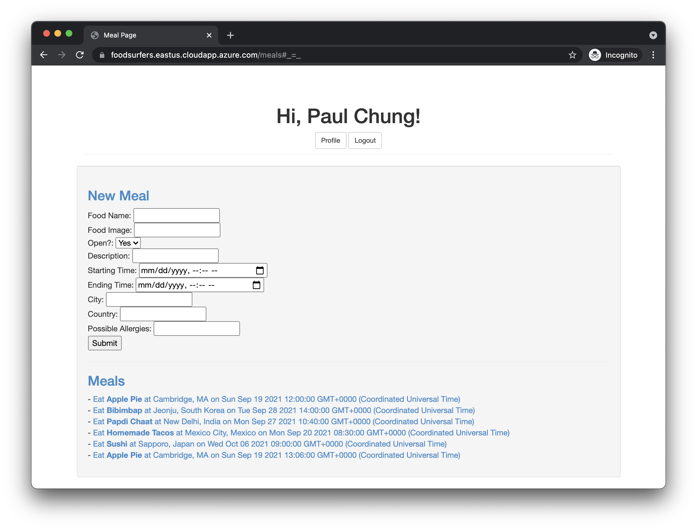

# FoodSurfers (HackMIT 2021)
Authors: Paul Chung, Pulkit Girdhar, Harsh Garg, and Vibhu Soni.

Food sharing platform based on Express, Passport-facebook, and PostgreSQL.

Meet up with other people worldwide and have a fantastic and engaging meal!

### Setup
1. Install and configure NodeJS and PostgreSQL.
2. Change DB access constants in ```/models/dbConfig.js```.
3. Change ```facebookStrategy``` credentials in ```/app.js``` to include your App ID.
4. Change Facebook callback URL in ```/app.js```.
4. Navigate to server directory in terminal and do ```npm i```.
5. Execute dbinit.sql on your PostgreSQL server.
6. Get a pair of SSL certificates, put it in ```/cert```, and edit ```privateKey``` and ```certificate``` constants in ```/app.js```.
7. Fire up the server!


### Demo

